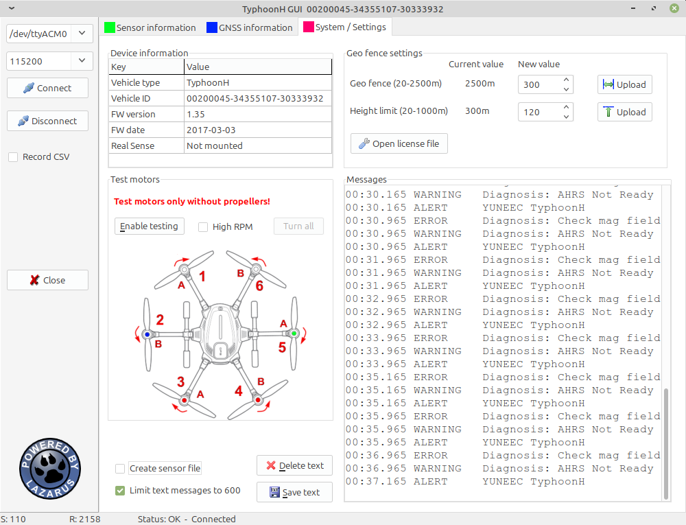

# H480_GUI
**Alternative GUI for Yuneec Typhoon H**

This tool provides a replacement for the Typhoon H GUI. It offers a deep insight how the flight controller interacts with its sensors. It is a good tool for a first diagnosis in case of problems.

Download this tool from download area in my homepage: http://h-elsner.mooo.com/html/downl.htm
Binaries for Windows (.zip) and LINUX (.tar.gz) are available. 

Installation: No installation, simply unzip the file. It is a portable application. You need only the executable for your OS. Copy it somewhere in the home file system or to an USB stick.

To compile this tool you need the common units from this repo: https://github.com/h-elsner/common_units 

Also the packages Synapse and Industrial stuff have to be installed (use OPM).
